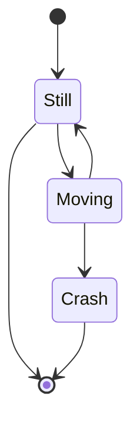

This will be a live document for docusaurus formatting reference.
<!-- truncate -->

## Markdown

- [Quick markdown reference](https://commonmark.org/help/)

### Heading 3

#### Heading 4

##### Heading 5

###### Heading 6

> Yesterday is history, tomorrow is a mystery.<br />
> But today I missed sleep, that's why I should sit down and evaluate my life choices.
> 
> — not *Master Oogway*

<details>
    <summary>Collapsible</summary>

    Hi :)

    <details>
        <summary>Nested</summary>

        Hi :))
    </details>
</details>

---

## Tabs

import Tabs from '@theme/Tabs';
import TabItem from '@theme/TabItem';

<Tabs groupId="fruits">
  <TabItem value="apple" label="Apple" default>
    This is an apple 🍎
  </TabItem>
  <TabItem value="orange" label="Orange">
    This is an orange 🍊
  </TabItem>
  <TabItem value="banana" label="Banana">
    This is a banana 🍌
  </TabItem>
</Tabs>

<Tabs groupId="fruits">
  <TabItem value="apple" label="Apple" default>
    Test different tab group
  </TabItem>
  <TabItem value="orange" label="Orange">
    This is an orange 🍊
  </TabItem>
</Tabs>

## Code Blocks

```jsx showLineNumbers title="/src/components/HelloCodeTitle.js"
function HelloCodeTitle(props) {
  // highlight-start
  const test1 = "These";
  const test2 = "are";
  // highlight-end
  const test3 = "not";
  // highlight-start
  const test3 = "highlighted";
  // highlight-end
  return <h1>Hello, {props.name}</h1>;
}
```

## Admonitions

:::note
Note admonition.
:::

:::tip
Tip admonition
:::

:::info
Info admonition
:::

:::warning
Warning admonition
:::

::::note
Nested
:::danger
Danger admonition
:::
::::

## Maths

- [$\LaTeX$ maths symbols reference](https://www.math.uci.edu/~xiangwen/pdf/LaTeX-Math-Symbols.pdf)

Test inline math: $f\colon\R^{3}\to\R^{3}$ hi :)

$$
X\sim U[0,1]
$$

## Mermaid

- [Mermaid](https://mermaid.js.org/)

<Tabs>
    <TabItem value="diagram" label="Diagram" default>

    </TabItem>
    <TabItem value="source" label="Source" default>
```
stateDiagram-v2
    [*] --> Still
    Still --> [*]
    Still --> Moving
    Moving --> Still
    Moving --> Crash
    Crash --> [*]
```
    </TabItem>
</Tabs>
