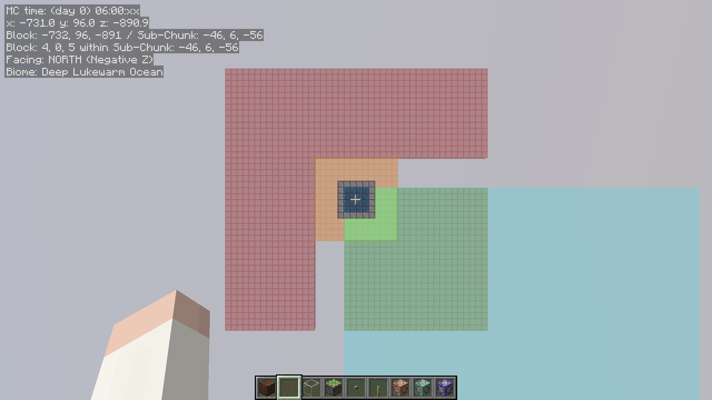

# Data & Verification

## Estimating Basic Spawn Rates

The end dimension serves as a nice testing environment where:

- There's only 1 spawnable mob type (endermen)
- The minimum and maximum pack size are the same (4)
- Controllable light level factors (no skylight and we can keep block light at 0)

Then with 1 full chunk of spawning platform at y 0:

- 1/2 of the attempts will be at y 0 and fail, 1/2 will be at y 1 and can start
- Most of the pack will succeed except when the jump lands in one of the previous positions (in the same pack or one of the previous packs in the same overall attempt)
or outside of the spawning area (the chunk).  
  So we expect slightly less than 4 endermen per y 1 attempt.
  - We can simulate the spawning algorithm in this simplified settings:

    <details>
        <summary>Example simulation in python</summary>

        ```python
        import random

        Point = list[int, int]

        def pack_jump(point: Point) -> Point:
            new_x = point[0] + (random.randint(0, 5) - random.randint(0, 5))
            new_z = point[1] + (random.randint(0, 5) - random.randint(0, 5))
            return [new_x, new_z]

        def is_out_of_chunk(point: Point) -> bool:
            return point[0] < 0 or point[0] > 15 or point[1] < 0 or point[1] > 15

        def fixed_pack_size_spawn_within_chunk(pack_size: int) -> list[list[Point], int, int, int]:
            spawn_points = []
            num_spawns = 0
            num_overlaps = 0
            num_out_of_chunk = 0
            starting_point = [random.randint(0, 15), random.randint(0, 15)]
            for _ in range(3):
                current_point = starting_point
                for __ in range(pack_size):
                    current_point = pack_jump(current_point)
                    if is_out_of_chunk(current_point):
                        num_out_of_chunk += 1
                        continue
                    if current_point in spawn_points:
                        num_overlaps += 1
                        continue
                    spawn_points.append(current_point)
                    num_spawns += 1
                    if num_spawns >= 4:
                        break
                if num_spawns >= 4:
                    break
            return [spawn_points, num_spawns, num_overlaps, num_out_of_chunk]
        ```
    </details>
    Running 10 million of this simulation results in 3.817538 endermen per attempt.

So we expect the spawns/hour to be about 3.817538 * (1/2) * 20 * 60 * 60 = 137,431.368.  
Running `/spawn tracking` after `/tick sprint 30d` (10h) with a repeating command block to remove all endermen each tick to make room on the platform gives about 137,527.

## Minimal Skirts for Maximum Rates

### Same Structure/Biome Example

The setup:

- Carpet `/spawn tracking` after `tick sprint 30d` (10h)
- [Spawn forcer](https://github.com/WaterGenie3/spawn-forcer) mod with `spreadJump true`
- 4x4 spawning platform at y 0 in the end (only endermen, pack size 4)

Here, we expect the skirt to increase the rates up to 5 x pack size, so 20 for the endermen in the end dimension.  
And that going any further out should provide no increase.

| Setup | Skirt | Spawns/hour |
| :-: | :-- | --: |
| A | 0 | 1,427 |
| B | \<=5 | 13,390 |
| C | \<=20 | 25,949 \| 25,850 \| 25,994 |
| D | \<=25 | 25,967 \| 25,884 \| 25,819 |

Example platform with birch for 5, oak for 20, and cherry for 25:


### Guardian Example

The setup ([world download](https://drive.google.com/file/d/1DKNfejBvl0hUEbW5_u30htbVaXYUE4am/view?usp=sharing)):

- Carpet `/spawn tracking` after `tick sprint 30d` (10h)
- Spawn forcer with `spreadJump true`
- 4x4 spawning area, whole monument tall, enclosed in tinted glass
- The \<=20 outside skirt leaves 5 block gap from the monument because those starting points can have first jumps inside the monument and subsequently jump into the farm. I.e. the \<=20 setup is meant to test for 6+.
- Local water creature and water ambient switch

Here, we expect the outside skirt to max out at 5, and the inside skirt max out at 20 as normal.

Note with `spreadJump`, packs are more spread out, so small spawning platform I used in these tests to make any skirt influence relatively larger will have lower rates compared to the vanilla spread.  
The `spreadJump` rule is only meant to detect the effects (or the lack thereof) from skirts that are further from the farm.

| Setup | Skirt | Spawns/hour |
| :-: | :-- | --: |
| A | 0 | 282 |
| B | \<=5 outside | 2,188 |
| C | \<=20 outside | 2,181 |
| D | \<=5 inside | 1,177 |
| E | \<=20 inside | 1,893 |
| F | \<=5 outside and \<=20 inside | 3,856 |

Example test setup with orange for \<=5 outside, red \<=20 outside, lime \<=5 inside, and green \<=20 inside:


In practice, we'd also fill in the gaps between the red and green (i.e. orange stretches out as long as its first jump landing inside can still reach the farm).

### Wither Skeleton Example

The setup ([world download](https://drive.google.com/file/d/1eQfkj7J5XNqkEV4LYRmQPd5PSt73jzCN/view?usp=sharing)):

- Carpet `/spawn tracking` after `tick sprint 30d` (10h)
- Spawn forcer with `fixedBottomY true` and `chunkBottomY 49` and `spreadJump true`
- Normal skirt has +1 to y from where they should ideally be so that the heightmap is the same when comparing with nether bricks (n-brick) that will have an extra y level on top for a spawn-proofing block

| Setup | Skirt | Spawns/hour |
| :-: | :-- | --: |
| A | 0 | 1,363 |
| B | \<=5 normal top-floor | 10,835 |
| C | \<=6+ normal top-floor | 10,771 |
| D | \<=5 n-brick top-floor | 13,821 |
| E | \<=5 n-brick all-floor | 16,760 |
| F | \<=20 n-brick all-floor | 30,117 |
| G | \<=20 n-brick all-floor, 21-25 normal top-floor | 30,385 |
| H | \<=25 n-brick all-floor | 30,384 |

- Setup B and C getting the same results show that the skirt outside of the structure/biome only maxes out at 5 blocks chebyshev in general (witch, guardians, etc.), and that the outside skirt benefit also applies to fortress.
- Setup D show an increase compared to B because it also allows inside starting point with outside first jump to still be a fortress mob instead of an outside mob.
- Setup D and E show the benefit from lining all floors.
- Setup G show an increase compared to F because wither skeleton with pack size 5 can have a starting point at 21-25, with first jump in 16-20, and still get into the farm with the remaining jumps.
- Setup H shows that this maxes out at G because any first jump at 21-25 nether brick will be too far to get into the farm.

Note that the \<=20 n-brick all-floor in setup D to H is further limited to within the full fortress bounding box.  
E.g. if on one side, \<=20 is still in the full bounding box, then the maximum would be setup G on that side. And if on another side, the full bounding box goes 14 blocks out, then the maximum would be \<=14 n-brick all-floor and 15-19 normal top-floor on that side.

Example wiske skirt with setup G on 2 floors:

