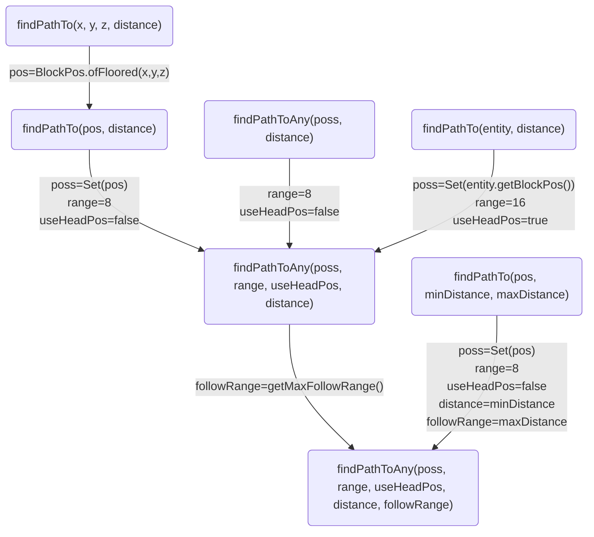
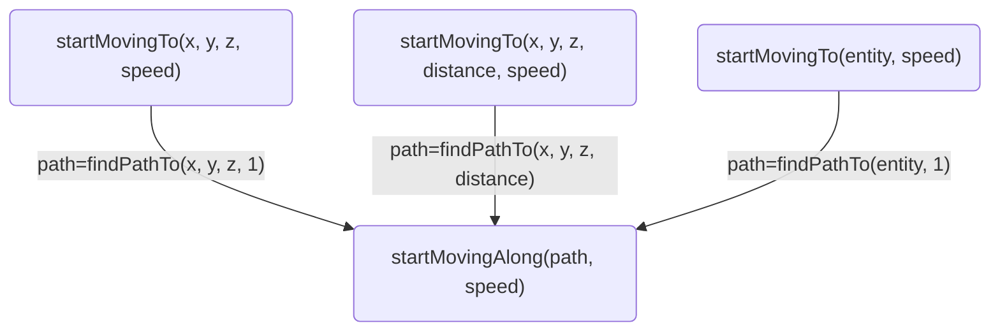
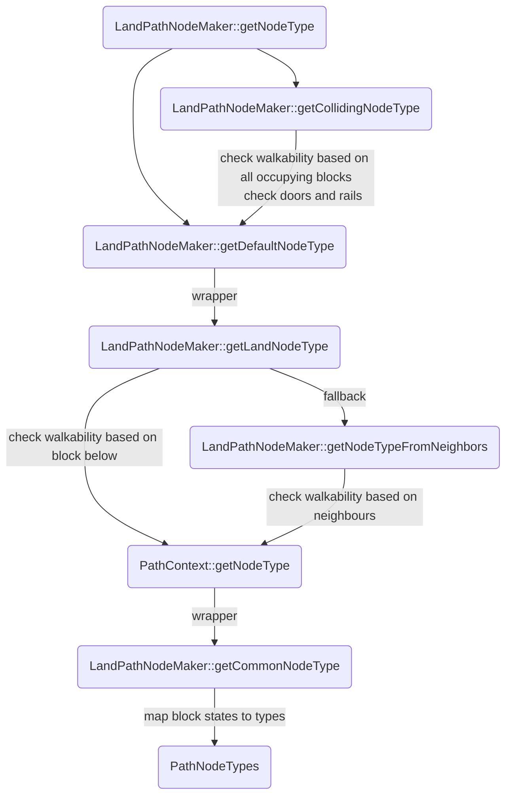

# Code

Currently veryyyy messy, mostly just a note for myself.  
Also try switching to mojang mapping to eliminate misinterpretation in the naming.

## `EntityNavigation`

```java
Path currentPath
double speed
int tickCount
int pathStartTime
Vec3d pathStartPos = Vec3d.ZERO
Vec3i lastNodePosition = Vec3i.ZERO
long currentNodeMs
long lastActiveTickMs
double currentNodeTimeout
float nodeReachProximity = 0.5 chebyshev
boolean inRecalculationCooldown
long lastRecalculateTime
PathNodeMaker nodeMaker // set by subclasses, see table below
BlockPos currentTarget
int currentDistance
float rangeMultiplier = 1
PathNodeNavigator pathNodeNavigator = createPathNodeNavigator(range: floor("entity's base follow range" * 16))
boolean nearPathStartPos
float maxFollowRange = 16

// See break-down in subsections below
findPathTo stuff
moveTo stuff

isValidPosition(BlockPos pos):
    getBlockState(pos.down()).isOpaqueFullCube()
abstract isAtValidPosition() // see table below

isIdle(): currentPath == null or currentPath.isFinished()
isFollowingPath(): !isIdle()
stop(): currentPath = null
```

Navigation subclass:

| Navigation | PathNodeMaker | `isAtValidPosition()` | `isValidPosition(pos)` |
| :-- | :-- | :-- | :-- |
| Mob | Land | `isOnGround() or isInFluid() or hasVehicle()` | below is opaque full cube |
| Bird | Bird | `(canSwim() and isInFluid()) or !hasVehicle()` | has solid top surface |
| Swim | Water | `canJumpOutOfWater (dolphin only) or isInFluid()` | not opaque full cube |
| Amphibious | Amphibious | `always true` | below is not air |
| Bee | Bird | Bird's | Bird's |
| Turtle | Amphibious | Amphibious' | travelPos ? pos is water : below is not air |
| Strider | Land | Mob's | Mob's or is lava |
| Frog | Frog | Amphibious' | Amphibious' |
| Warden | Land | Mob's | Mob's |
| Creaking | Creaking | Mob's | Mob's |

### Tick

```python
if inRecalculationCooldown:
    # Cooldown defaults to false
    # So this is only called after recalculatePath has been called first
    # and throttles all subsequent recalculation until the 21st gt after the previous call.
    # (Multiple recalc <= 20 gt of the previous reduces to 1 at the 21st gt)
    recalculatePath()
if isIdle():
    return

if isAtValidPosition():
    continueFollowingPath()
else if (currentPath != null) and (!currentPath.isFinished()):

```

1. `recalculatePath` if `inRecalculationCooldown`
    - Cooldown defaults to false, so this is only called after `recalculatePath` is called first and throttles all subsequent `recalculatePath` calls until the 21st gt after the previous call.  
    (Multiple recalculation \<= 20 gt of the previous call reduces to 1 call at the 21st gt)
2. End if `isIdle`
3. `continueFollowingPath` if `isAtValidPosition`

### `findPathTo`


### `recalculatePath`

```python
if (now - lastRecalculationTime > 20) and (currentTarget != null):
    currentPath = findPathTo(currentTarget, currentDistance)
    lastRecalculateTime = now
    inRecalculationCooldown = false
else:
    inRecalculationCooldown = true
```

### `moveTo`


## PathNodeNavigator

```java
static float TARGET_DISTANCE_MULTIPLIER = 1.5
PathNode[] successors
int range
PathNodeMaker pathNodeMaker
PathMinHeap minHeap

getDistance(PathNode a, PathNode b) // euclidean
calculateDistances(PathNode node, Set<TargetPathNode> targets)
    // smallest euclidean distance from node to each targets

createPath(PathNode endNode, BlockPos target, boolean reachesTarget)
    // list PathNodes by backtacking all previous nodes starting from endNode
    return new Path(list, target, reachesTarget)

findPathToAny(world, mob, positions, followRange, distance, rangeMultiplier)
    // call findPathToAny with startNode = pathNodeMaker.getStart()
findPathToAny(startNode, positions, followRange, distance, rangeMultiplier)
```

## PathNodeMaker

```java
int entityBlockXSize = floor(entity.getWidth() + 1)
int entityBlockYSize = floor(entity.getHeight() + 1)
int entityBlockZSize = floor(entity.getWidth() + 1)
boolean canEnterOpenDoors
boolean canOpenDoors
boolean canSwim
boolean canWalkOverFences

isFireDamaging(BlockState state)
    // fire block tag or lava or lava cauldron or magma block or lit campfire

// Abstract:
PathNode getStart()
TargetPathNode getNode(int x, int y, int z)
int getSuccessors(PathNode[] successors, PathNode node)
PathNodeType getNodeType(PathContext context, int x, int y, int z, MobEntity mob)
PathNodeType getDefaultNodeType(PathContext context, int x, int y, int z)
```

### LandPathNodeMaker

```java
getStart():
    y = entity.getBlockY()
    if !entity.canWalkOnFluid(pos):
        if canSwim() and entity.isTouchingWater():

        else if entity.isOnGround():
            y = 
    else:
        // Shift y up until it's the top-most consecutive walkable fluid
        while entity.canWalkOnFluid(pos with y):
            y++
        y--
```

## Path

List of `PathNode`

```java
List<PathNode> nodes
BlockPos target
int currentNodeIndex
float manhattanDistanceFromTarget = nodes[-1].getManhattanDistance(target)
boolean reachesTarget

isStart(): currentNodeIndex <= 0
next(): currentNodeIndex++
isFinished(): currentNodeIndex >= nodes.size()
getEnd(): nodes[-1]
getLastNode(): nodes[currentNodeIndex - 1]
setLength(length) // clear nodes[length:]
```

## PathMinHeap

Array implementation of min heap of nodes based on node's `heapWeight`

```java
PathNode[] pathNodes = new PathNode[128]
int count

push(node)
pop()
popNode(node) // deleteNode() better name?
setNodeWeight(node, weight)
```

## PathNode

Pathfinding node

```java
int x
int y
int z
int hashCode = hash(x, y, z)
int heapIndex = -1
float penalizedPathLength
float distanceToNearestTarget
float heapWeight
PathNode previous
boolean visited
float pathLength
float penalty
PathNodeType type = PathNodeType.BLOCKED

hash(x, y, z):
    y & 0xFF | (x & 32767) << 8 | (z & 32767) << 24 | (x < 0 ? Integer.MIN_VALUE : 0) | (z < 0 ? 32768 : 0)

isInHeap(): heapIndex >= 0

// Euclidean:
getDistance(...)
getHorizontalDistance(...)
getSquaredDistance(...)

// Manhattan:
getManhattanDistance(...)
```

### TargetPathNode

Extends `PathNode`

```java
float nearestNodeDistance
PathNode nearestNode
boolean reached
```

## PathNodeType

`LandPathNodeMaker`:


### Node Types

| Type | Default Penalty |
| :-- | --:|
| Blocked | -1.0 |
| Open | 0.0 |
| Walkable | 0.0 |
| Walkable door | 0.0 |
| Trapdoor | 0.0 |
| Powder snow | -1.0 |
| Danger powder snow | 0.0 |
| Fence | -1.0 |
| Lava | -1.0 |
| Water | 8.0 |
| Water border | 8.0 |
| Rail | 0.0 |
| Unpassable rail | -1.0 |
| Danger fire | 8.0 |
| Damage fire | 16.0 |
| Danger other | 8.0 |
| Damage other | -1.0 |
| Door open | 0.0 |
| Door wood closed | -1.0 |
| Door iron closed | -1.0 |
| Breach | 4.0 |
| Leaves | -1.0 |
| Sticky honey | 8.0 |
| Cocoa | 0.0 |
| Damage cautious | 0.0 |
| Danger trapdoor | 0.0 |

### Land `getCommonNodeType`

Maps the given block to a node type.

| Block | Node Type |
| :-- | :-- |
| Air | Open |
| Trapdoors, lily pad, big dripleaf | Trapdoor |
| Powder snow | Powder snow |
| Cactus, sweet berry bush | Damage other |
| Honey block | Sticky honey |
| Cocoa | Cocoa |
| Wither rose, pointed dripstone | Damage cautious |
| Lava, flowing lava | Lava |
| Fire. soul fire, magma block, lit campfire, lava cauldron | Damage fire |
| Open door | Door open |
| Closed wooden/copper doors | Door wood closed |
| Closed iron door | Door iron closed |
| All rail types | Rail |
| Leaves | Leaves |
| Fences, walls, closed fence gates | Fence |
| Full cube collision shape | Blocked |
| Water, flowing water | Water |
| Everything else | Open |

### Land `getNodeTypeFromNeighbors`

Check walkability based on 24 surrounding blocks
(3x3x3 centred around the block not including the middle column).

Directional; starting from -1 x, y, z (west, up, north), moving z, then y, then x, all in the positive direction.  
Marks the block as `walkable` unless any of the 24 blocks meets the following ordered conditions.  
First neighbour found to meet a condition determines the type.

| Order | Neighbour Type | Resulting Type |
| :-: | :-- | :-- |
| 1 | Damage other | Danger other |
| 2 | Damage fire or lava | Danger fire |
| 3 | Water | Water border |
| 4 | Damage cautious | Damage cautious |

### Land `getLandNodeType`

Check walkability based on the block below.

If the position itself is not `open` as determined by the `getCommonNodeType` or is at the world bottom,
it will use that type.
Otherwise, determine the walkability based on the `getCommonNodeType` of the block below based on the following conditions.  
If none of the conditions are met, the walkability is determined by the surrounding blocks in `getNodeTypeFromNeighbors`.

| Type Below | Resulting Type |
| :-- | :-- |
| Open, water, lava, walkable | Open |
| Damage fire | Damage fire |
| Damage other | Damage other |
| Sticky honey | Sticky honey |
| Powder snow | Danger powder snow |
| Damage cautious | Damage cautious |
| Trapdoor | Danger trapdoor |

### Land `getCollidingNodeTypes`

Collect the node types for all the blocks the entity occupies, considering doors and rails.

For each block the entity occupies, modifies the node type as determined by `getLandNodeType`
and add the resulting type.

| From land node type | Condition | Resulting Type |
| :-- | :-- | :-- |
| Door wood closed | Can open and can enter open doors | Walkable door |
| Door open | Can't enter open doors | Blocked |
| Rail | `getLandNodeType` of the entity's position and the block below are not rails | Unpassable rail |
| Everything else | - | Same |

I.e.:
 - Closed iron door is blocked
 - Closed wooden/copper doors are walkable if entity can open and can enter open doors
 - Open doors are walkable if entity can enter open doors
 - Rails are unpassable if the entity is not already on one

:::warning
Check positioning.

This method starts at (0,0,0) relative to the given (x,y,z) and loops though entity's block size going in the positive direction.
I.e. for entities with width > 1, check if it's possibly missing the negative positions and including extra positive positions.

E.g. iron golem with width 1.4 and height 2.7 has block dimension 2x3x2,
and if its horizontal position is at (0.7,0.7),
IF this method starts at the golem's position, then it would be covering squares with corners (0,0) and (1,1), which would be fine.  
But if its horizontal position is at (0.5, 0.5), then it's also partially in (-1,-1), (-1,0), (-1,1), (0,-1), and (1,-1),
but the coverage will still be the same instead of being squares with corners (-1,-1) and (1,1).

See if we can find an exposing example.
:::

### Land `getNodeType`

Determine node type based on all blocks the entity occupies as determined by `getCollidingNodeTypes`.

1. Check if blocks the entity occupies satisfy any of the following ordered conditions:

| Order | Colliding Type | Resulting Type |
| :-: | :-- | :-- |
| 1 | Contains fence | Fence |
| 2 | Contains unpassable rail | Unpassable rail | 
| 3 | Contains type with negative pathfinding penalty | The colliding type |

2. Get the colliding type with the highest path finding penalty
3. If the entity width is \<= 1, type in step 2 is not open, and the type as determined by `getLandNodeType` is open, then use type open, otherwise use the type in step 2.
